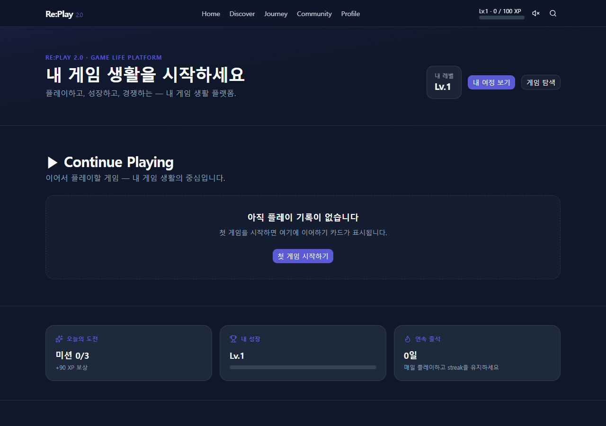
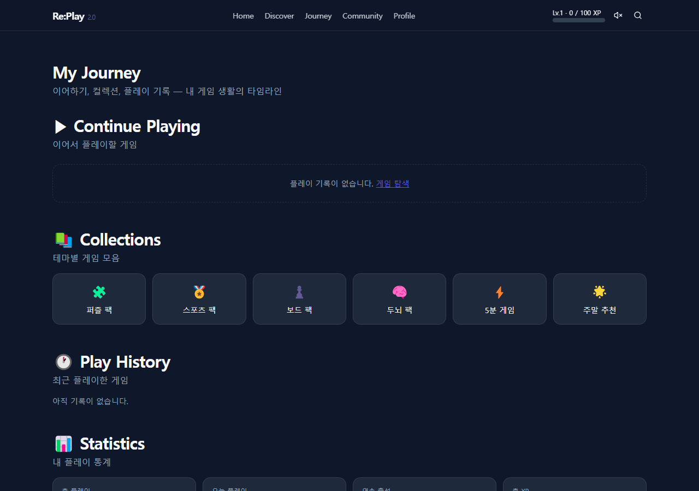
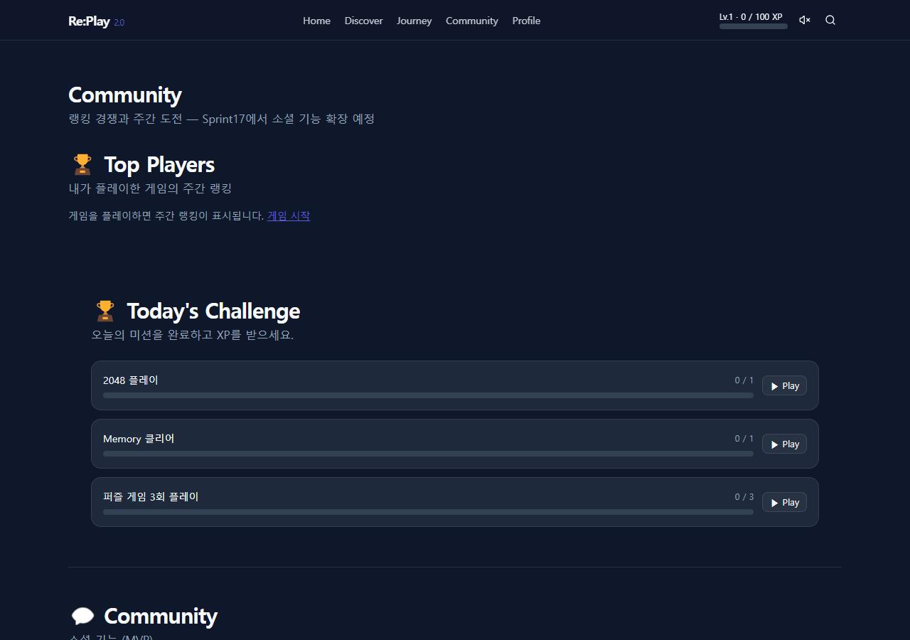
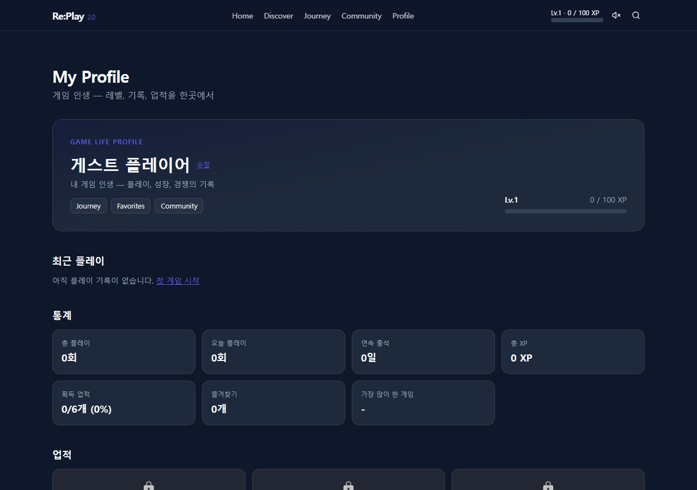

# Epic1 Complete Report — Identity Pivot

**Date:** 2026-07-25  
**Sprint:** 16 — Re:Play 2.0 Game Life Platform  
**Epic:** 1 — Identity Pivot  
**PM Verdict:** GO ✅

---

## Branch / Commit / Preview / Deployment

| Field | Value |
|-------|-------|
| **Branch** | `content-factory` |
| **Commit** | `8fdecf9` |
| **Preview (commit-specific)** | https://game29-8e0jp39xo-jyp-ai1s-projects.vercel.app |
| **Preview (branch alias)** | https://game29-git-content-factory-jyp-ai1s-projects.vercel.app |
| **Deployment** | https://vercel.com/jyp-ai1s-projects/game29/EBi85FVUWsdkVZcFkpkJZq9a1JzF |
| **Before reference (c000ffe)** | https://game29-mqqsuwgtr-jyp-ai1s-projects.vercel.app |

> **Note:** Vercel Preview Protection is enabled — automated screenshot bots see the Vercel login gate.  
> After screenshots below were captured from **local production build** (`localhost:3020`, commit `8fdecf9`).  
> Before Home: open **c000ffe Preview URL** in browser (logged-in) to compare.

---

## Epic1 Home 2.0 — Before → After

### Before (c000ffe)

- 레트로 히어로 ("Play Again. Feel Again.")
- Nav: Games / Favorites / Profile / Ranking(Soon)
- 게임 캐러셀 나열 중심
- Journey / Community **없음** (404)

**Before Preview:** https://game29-mqqsuwgtr-jyp-ai1s-projects.vercel.app

### After (8fdecf9)

- **Re:Play 2.0 · Game Life Platform** identity hero
- **Continue Playing** 최상단 (빈 상태 CTA 포함)
- 오늘의 도전 / 내 성장 / 연속 출석 3카드
- Nav: Home · Discover · Journey · Community · Profile

---

## Screenshots — After (8fdecf9, local build)

| Page | Screenshot |
|------|------------|
| **Home** |  |
| **Journey** |  |
| **Community** |  |
| **Profile** |  |

### Before (reference)

| Page | Status |
|------|--------|
| Home | c000ffe Preview — retro hero layout |
| Journey | **신규** (Epic1 전 404) |
| Community | **신규** (Epic1 전 404) |
| Profile | c000ffe Preview — 기본 닉네임/통계/업적 |

---

## UX Improvement

- Continue Playing **홈 최상단** 배치
- **Journey** 허브 신설 (Continue · Collections · History · Stats)
- **Community** MVP (Top Players · Daily Challenge · Social Soon)
- **Bottom Navigation** (375px, 5탭)
- Game Detail **Stats Panel** (Top3 · 내 기록 · 난이도 · 플레이시간)
- Profile **Game Life** 헤더 + Journey/Community 링크

---

## 서비스 가치 (예상)

| Metric | Impact |
|--------|--------|
| **Retention** | ↑ Continue Playing + Daily Challenge 노출 |
| **Session** | ↑ Journey 허브로 재방문 경로 |
| **Identity** | ↑ Lv/XP/Profile 중심 첫인상 |

*(실측 Analytics 데이터는 Preview Protection 해제 + 트래픽 후 검증)*

---

## QA

| Gate | Status | URL / Command |
|------|--------|---------------|
| Typecheck | **PASS** | `npm run typecheck --workspace=@game-platform/web` |
| qa:quality (static) | **PASS** | `npm run qa:quality` |
| Regression 50/50 | **PASS** | static sweep |
| Metadata 50/50 | **PASS** | |
| **RC1 Score** | **93%** | `/admin/release-dashboard` |
| E2E Epic1 | **PENDING** | `QA_BASE_URL=https://game29-8e0jp39xo-jyp-ai1s-projects.vercel.app npm run test:e2e -- tests/e2e/sprint16-epic1.spec.ts` |
| Performance / 404 | **SKIP** | Preview Protection + live server |

**QA 실행 URL**

- Preview: https://game29-8e0jp39xo-jyp-ai1s-projects.vercel.app
- Local: http://localhost:3020
- Release Dashboard: `/admin/release-dashboard`

**Known Issue:** Preview Protection → E2E/자동 스크린샷 차단. Bypass Token 발급 시 QA 자동화 가능.

---

## 다음 Epic

**Epic2 — Personal Journey** (~12h)

- Play History 타임라인
- GuestID/Journey 심화
- Statistics 대시보드

**위험요소:** 운영 데이터 없음 → localStorage UX만 검증 중

---

## PM 5분 체크리스트

1. Preview 로그인 → Home에서 "Re:Play 2.0" + Continue Playing 확인
2. Bottom Nav 5탭 (375px) 확인
3. Journey → Collections 6개 확인
4. Community → Top Players + Soon 배지 확인
5. Profile → Game Life 헤더 확인
